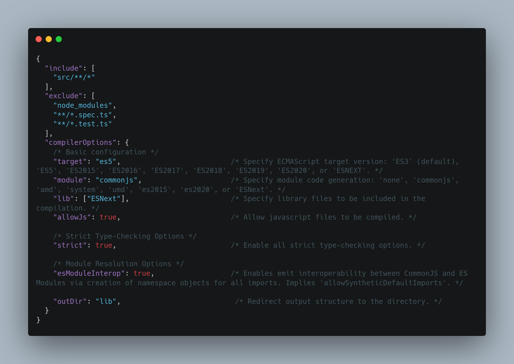
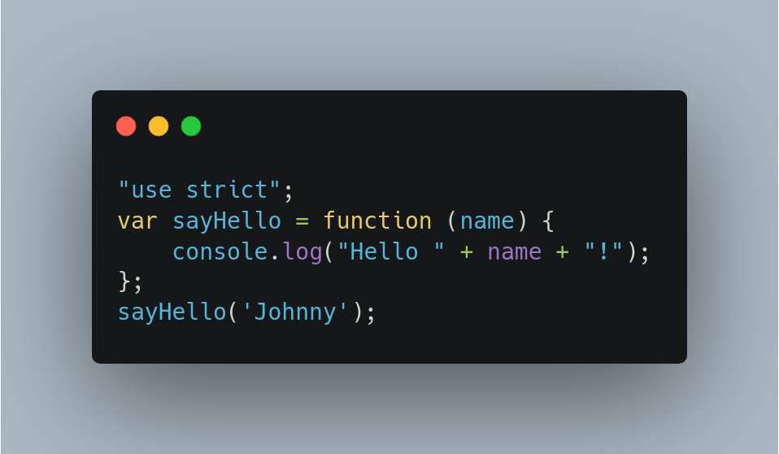

# Setup project with TypeScript

## Create project
We can easily create project the same way we create JS project. Let’s start from creating a directory for our new project. I will call my project something. Let’s create a directory and get access to it.
```
  mkdir something
  cd something
```
Next we should create a project with npm. If we use npm init with -y flag than we don’t have to answer for all the default questions. After that step we will have package.json file with configuration of our project
```
  npm init -y
```
Now, we should install TypeScript and also types definitions for node.js environment. We can do that like shown below.
```
  npm install --save-dev typescript
  npm install --save-dev @types/node
```
At the end we have to initialize TS in our project. Instruction given below will do that and also it will create compilation context and tsconfig.json file.
```
  tsc --init
```
<hr />

## What is compilation context of TS?
The compilation context is a name for grouping of TS files that will be parsed and analysed by compiler to determine what is valid and what’s not. It also contains information about options of the compiler that are in use. We can define mentioned grouping or options of the compiler by using tsconfig.json file.

<hr />

## Compiler options, how to read them?
At the moment your tsconfig.json looks like a mess and contains many commented out options. Don’t worry about it. We will change it to look more legibly. That’s how it looks like after changes.



Those are only basic configuration options. There are many more. I recommend checking documentation to get more information. You can find it in here.
Now we will go through those options and explain what are they for.

```
  "include": [
    "src/**/*"
  ],
  "exclude": [
    "node_modules",
    "**/*.spec.ts",
    "**/*.test.ts"
  ]
```
* include — specifies an array of filenames or patterns to be included in the program (which files should be included in process of compilation)
* exclude — specifies an array of filenames or patterns that should be skipped when resolving include (which files should be skipped in compilation)

So it means that our compiler will look for ts files in src directory and all sub directories but it will skip all files with spec.ts or test.ts extension. Mentioned extensions are obviously extensions of tests.
Let’s go now to the compilerOptions section. I remove comments so it will be easier to read.

```
  "compilerOptions": {

    "target": "es5",

    "module": "commonjs",

    "lib": ["ESNext"],

    "allowJs": true,

    "strict": true,

    "esModuleInterop": true,

    "outDir": "lib",
  }
```
* Target sets the JavaScript language version for emitted JavaScript. Default it is ES3. In our case we set ES5.
* Module specifies what module code is generated (usually CommonJS if target is ES3 or ES5. Otherwise ES6/ES2015)
* Lib specifies a set of bundled library declaration files that describe the target runtime environment. We used ESNext so it will give us access to the newest features of JS.
* AllowJs allows JavaScript files to be a part of your program. It’s boolean so we set it on ‘yes’ if we want to include JS files and on ‘false’ otherwise.
* Strict enables all strict type-checking options. Strict mode guarantees stronger correctness of our program.
* EsModuleInterop emits additional JavaScript to ease support for importing CommonJS modules. It provides cooperation between CommonJS format and ES modules.
* OutDir specify an output folder for all emitted files. In our case output files will come to the lib directory.

<hr /> <hr />

## Let’s try to run it
First we will make folder for our ts files. It has to be named src just like we set it in our config file tsconfig.json.
```
  mkdir src
```

Let’s create a file in this folder. I will name my file hello.ts. Next I will add some simple code in TypeScript to it like shown below.

```
  const sayHello = (name:string) => {
    console.log(`Hello ${name}!`)
  }
  sayHello('Johnny');
```

As you can see we set type of argument name to string. That means if we pass value of any other type TS will return error.
***

Now to compile it just run it by typing tsc in terminal.
```
  tsc
```
After compilation ends we can see that we have a lib folder with output file in JS. Check on that file. In my case it looks like that:



You won’t find any type checking in that code. That’s because compiler is checking all declarations and returns error if something is wrong. You can try to pass a value with different type and see what’s going to happen.
***
At the end I would like to also mention that you can use tsc with -w flag. It turns on watch mode of compiler so changes are applied live without reloading.
```
  tsc -w
```


[<---prevoius](WhatIsTypeScript.md)                                                                            <p align='right'>[next--->](3.BasicTypesArraysAndObjects.md)</