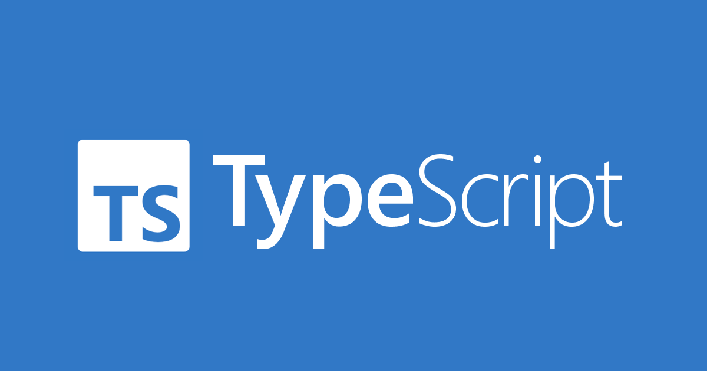

# LearningTypeScript

## Playing with TypeScript

1. [What is TypeScript?](1.WhatIsTypeScript.md)
2. [How to setup project with TS.](2.SetupProjectWithTypeScript.md)
3. [Basic types, arrays and objects.](3.BasicTypesArraysAndObjects.md)
4. [Unions of types, enums, tuples and aliases.](4.UnionsOfTypesEnumsTuplesAndAliases.md)
5. [Functions in TypeScript.](5.FunctionsInTypeScript.md)
6. [Generic types in TS.](6.GenericTypes.md)
7. [Functional programming with TS.](7.FunctionalProgrammingInTypeScript.md)
8. [Classes and Interfaces in TS.](8.ClassesAndInterfacesInTypeScript.md)
9. [OOP in TS.](9.OOPInTypeScript.md)
10. [Clean code rules for TS.](10.CleanCodeRulesInTS.md)